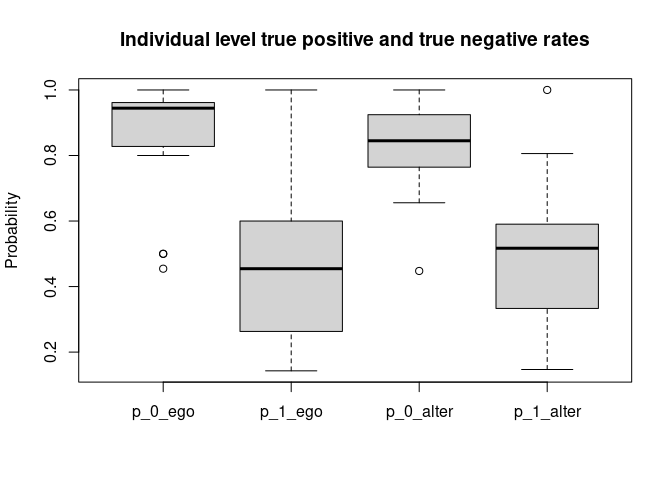

<!-- README.md is generated from README.Rmd. Please edit that file -->

# imaginarycss

<!-- badges: start -->
<!-- badges: end -->

The goal of imaginarycss is to …

## Installation

You can install the released version of imaginarycss from
[CRAN](https://CRAN.R-project.org) with:

``` r
install.packages("imaginarycss")
```

And the development version from [GitHub](https://github.com/) with:

``` r
# install.packages("devtools")
devtools::install_github("gvegayon/imaginary-structures")
```

## Example

This is a basic example which shows you how to solve a common problem:

``` r
library(imaginarycss)

source_ <- c(1, 2, 3, 1) 
target_ <- c(2, 1, 4, 4)

source_ <- c(source_, source_[-1] + 4)
target_ <- c(target_, target_[-1] + 4)

adjmat <- matrix(0L, nrow = 8, ncol = 8)
adjmat[cbind(source_, target_)] <- 1L

graph <- new_barry_graph(adjmat, n = 4)
graph
#> A barry_graph with 2 networks of size 4
#> .    .  1.00     .  1.00     .     .     .     . 
#>  1.00     .     .     .     .     .     .     . 
#>     .     .     .  1.00     .     .     .     . 
#>     .     .     .     .     .     .     .     . 
#>     .     .     .     .     .     .     .  1.00 
#>     .     .     .     .  1.00     .     .     . 
#>     .     .     .     .     .     .     .  1.00 
#>     .     .     .     .     .     .     .     .

# These are two attributes that are part of the barry_graph object
attr(graph, "endpoints")
#> [1] 8
attr(graph, "netsize")
#> [1] 4

count_recip_errors(graph)
#>    id                                    name value
#> 1   0    Partially false recip (omission) (0)     1
#> 2   0   Partially false recip (comission) (0)     0
#> 3   0   Completely false recip (omission) (0)     0
#> 4   0  Completely false recip (comission) (0)     0
#> 5   0            Mixed reciprocity errors (0)     0
#> 6   0                  (01) Accurate null (0)     3
#> 7   0  (02) Partial false positive (null) (0)     0
#> 8   0 (03) Complete false positive (null) (0)     0
#> 9   0 (04) Partial false negative (assym) (0)     0
#> 10  0                 (05) Accurate assym (0)     2
#> 11  0                    (06) Mixed assym (0)     0
#> 12  0 (07) Partial false positive (assym) (0)     0
#> 13  0 (08) Complete false negative (full) (0)     0
#> 14  0  (09) Partial false negative (full) (0)     1
#> 15  0                  (10) Accurate full (0)     0
```

``` r
krack_data <- read.csv("data-raw/advice_nets.csv")
krack_data <- as.matrix(krack_data)
n          <- 21

krack_adjmat <- matrix(0L, nrow = n * 22, ncol = n * 22)
krack_adjmat[krack_data] <- 1L

graph <- new_barry_graph(
  krack_adjmat,
  n = n
  )

ans <- count_recip_errors(graph)
head(ans)
#>   id                                 name value
#> 1  0 Partially false recip (omission) (0)    25
#> 2  1 Partially false recip (omission) (1)    78
#> 3  2 Partially false recip (omission) (2)    52
#> 4  3 Partially false recip (omission) (3)    63
#> 5  4 Partially false recip (omission) (4)    56
#> 6  5 Partially false recip (omission) (5)    56
```

Another example passing a list

``` r
library(network)
#> 
#> 'network' 1.18.1 (2023-01-24), part of the Statnet Project
#> * 'news(package="network")' for changes since last version
#> * 'citation("network")' for citation information
#> * 'https://statnet.org' for help, support, and other information
library(ergmito)
knet <- as.network(krack_adjmat)
knet %v% "id" <- rep(0:n, each = n)

netlist <- splitnetwork(knet, "id")
netlist <- lapply(netlist, as.matrix)

graph2 <- new_barry_graph(netlist)

all(barray_to_edgelist(graph2) ==
  barray_to_edgelist(graph))
#> [1] TRUE
```

Now checking that none of these coincide completely

``` r
# Removing the network id
ans$name <- gsub("\\([0-9]+\\)$", "", ans$name)
```

Checking out the distribution

``` r
library(ggplot2)

# keeping the onces from the census only
ans <- subset(ans, grepl("^\\([0-9]", name))

ggplot(data = ans, aes(y = value)) +
  geom_histogram() + 
  facet_wrap(vars(name)) +
  coord_flip() +
  labs(title = "Distribution of type of errors")
#> `stat_bin()` using `bins = 30`. Pick better value with `binwidth`.
```


Checking the tie level accuracy

``` r
taccuracy <- tie_level_accuracy(graph)
boxplot(
  taccuracy[,-1],
  main = "Individual level true positive and true negative rates",
  ylab = "Probability"
  )# Keeping only the ones from the census
```



``` r

# Sampling and using that to generate a new barray graph
graph_sampled <- new_barry_graph(
  sample_css_network(graph)
)

microbenchmark::microbenchmark(
  sample_css_network(graph)  
)
#> Unit: milliseconds
#>                       expr      min       lq     mean   median       uq
#>  sample_css_network(graph) 11.25291 11.65259 14.32988 12.15657 16.58535
#>       max neval
#>  32.85994   100

# Retrieving 1000 samples
set.seed(331)
samp <- replicate(n = 100, sample_css_network(graph), simplify = FALSE)
census <- lapply(samp, \(net) {
  count_imaginary_census(new_barry_graph(net))
})
```

## Self perception

We can also separate the counts as a function of whether the perceiver
is looking into all ties, only ties including them, or only ties not
including them.

``` r
census_all            <- count_imaginary_census(graph, counter_type = 0)
census_perceiver_only <- count_imaginary_census(graph, counter_type = 1)
census_no_perceiver   <- count_imaginary_census(graph, counter_type = 2)

# Should be zero
which_not <- census_all$value -
  (census_perceiver_only$value + census_no_perceiver$value)

length(census_all$name[which(which_not != 0)]) == 0L
#> [1] TRUE
```
